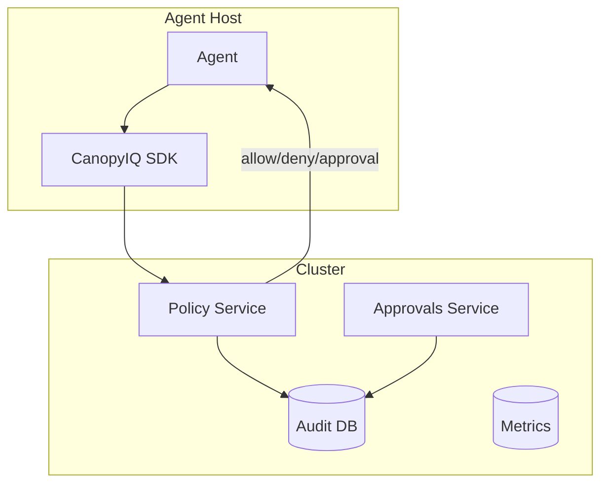

# Architecture Overview

- **Control plane**: policy service, approvals service, audit log, metrics
- **Data plane**: per-agent sandbox + lightweight decision SDK
- **Stateless**: horizontal scale
- **Storage**: Postgres (audit), S3/Blob (exports), optional Redis (queues)

